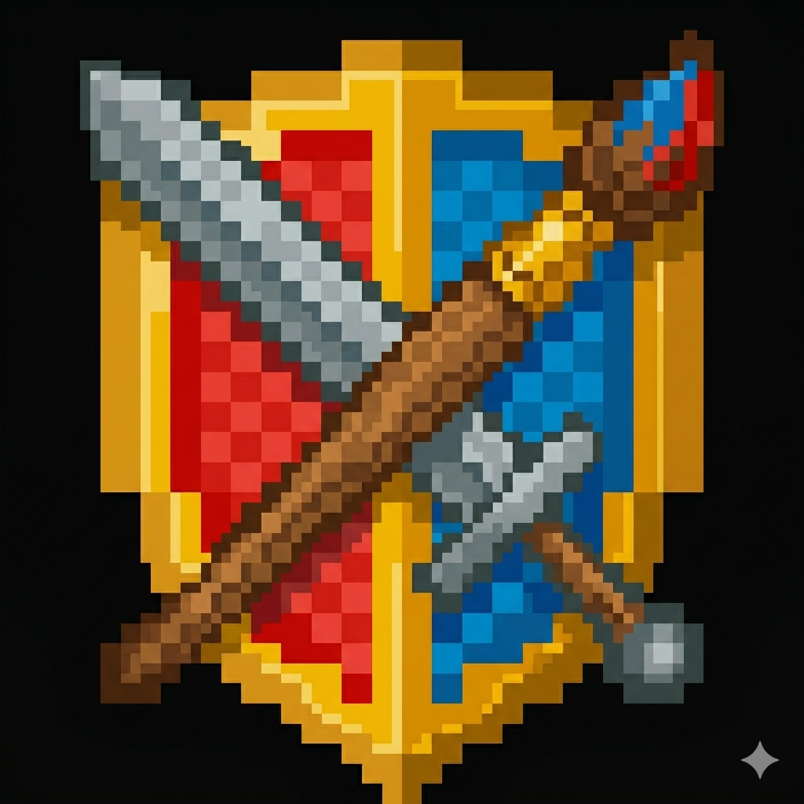

# Creatifight

A Minecraft mod that adds a new gamemode for players who want the thrill of building and fighting without worrying
about damage and dying. The *creatifight* mode combines the freedom of creative mode (unlimited resources, flight,
and invulnerability) with the excitement of survival mode (aggressive mobs to battle).

My inspiration for making this mod was playing Minecraft with family. Creative mode was wonderful, but enemies were
just plain boring to fight. Survival mode was exciting, but too hard and stressful. I was left wishing for a middle
ground between the two, where we could have a "safe" adventure playing together.

Enjoy, friends!

Download at: 
* [Curseforge](https://www.curseforge.com/minecraft/mc-mods/creatifight)
* [Modrinth](https://modrinth.com/mod/creatifight)
* [Github](https://github.com/keithfma/creatifight/releases)

Compatible with: Java Edition, NeoForge 1.21.1

| Command                                                       | Effect                                 |
|---------------------------------------------------------------|----------------------------------------|
| `/gamemode creatifight`                                       | Enter Creatifight mode                 |
| `/gamemode creatifight <player>`                              | Put another player in Creatifight mode |
| `/gamemode creative` / `survival` / `adventure` / `spectator` | Exit Creatifight to another mode       |

---

## For Developers

### How it works

Creatifight is implemented as a per-player flag on top of CREATIVE gamemode. The player keeps all creative
perks, but with `abilities.invulnerable = false` enforced by a per-tick check, which
lets mobs naturally target them via `canBeSeenAsEnemy()`. Incoming damage is silently zeroed at
`LivingIncomingDamageEvent`. The combined effect is that health never drops, but still fires every downstream effect. A
small set of mixins patch the spots where mob AI checks `isCreative()` directly instead of going through
`canBeSeenAsEnemy()`.

In creatifight mode, damage flow works like this:

1. Mob calls `target.hurt(source, amount)`.
2. `Player.hurt` proceeds, `abilities.invulnerable=false` so it doesn't early-return.
3. Inside `LivingEntity.hurt`, `LivingIncomingDamageEvent` fires → `CreatifightDamageHandler.setAmount(0)`.
4. Vanilla processing continues with amount=0: sets `hurtTime=10`, fires `broadcastDamageEvent` (sound + flash to all
   tracking clients), calls `knockback`, calls `indicateDamage` (directional red wedge), sets `lastHurtByMob`.
5. `actuallyHurt(source, 0)` → no health change.
6. Returns `true` → `Mob.doHurtTarget` sees the hit as successful and runs its post-attack effects (iron golem vertical
   bounce, ATTACK_KNOCKBACK push, attack sound, enchant procs).

`BYPASSES_INVULNERABILITY` damage (void, `/kill`) skips step 3 and passes through normally.

Environmental hazards that aren't fun to encounter while exploring (drowning, suffocation, freezing, fire, lava,
magma) are cancelled outright in `CreatifightDamageHandler`.

### World-default Creatifight

When creating a New World, "Creatifight" appears as a 5th option in the gamemode cycle button alongside Survival / Hardcore / Creative. Worlds created with it set persist a flag (via a NeoForge `Level`-level Attachment) and auto-apply Creatifight to each player on their first join; subsequent gamemode changes are sticky and the mod won't re-apply. Implementation is in `CreatifightWorldDefault` (the attachment), `CreatifightLoginHandler` (auto-apply + handoff consumer), and three client mixins (`SelectedGameModeMixin` extends the vanilla enum; `CreateWorldScreenMixin` + `CreateWorldScreenGameTabMixin` wire the UI).

### Releasing

To publish a new version: bump `mod_version` in `gradle.properties`, commit, and merge to `main` (or push directly). GitHub Actions detects the new version, builds the jar, creates a GitHub Release at `v<version>`, and publishes to Modrinth + CurseForge.

If the version in `gradle.properties` matches an existing tag, the workflow no-ops — pushing other changes to `main` doesn't re-publish.

### Verification

Quick smoke test after a code change:

1. `/gamemode creatifight`, summon a zombie, confirm it attacks visibly with no health drop.
2. `/gamemode creative` → "Exited Creatifight" message, zombie ignores you.
3. `/gamemode survival` round-trip → exit via standard path.
4. `/kill` → respawn → still in Creatifight, mobs still attack (verifies `.copyOnDeath()`).

For exotic mobs, `/summon` each and confirm attacks land: `warden`, `wither`, `ender_dragon`, `ravager`, `vex`,
`iron_golem`, `phantom`. For raids, stand in a real village (workstation POI cluster), `/effect give @s bad_omen 60 1`,
wait for raid bar.
### Rejected design options

- **New `GameType.CREATIFIGHT` enum entry**: NeoForge 1.21.1 doesn't support extending `GameType` cleanly. It doesn't
  implement `IExtensibleEnum`, world saves serialize gamemode as an int ID (force-extending would create a save-compat
  dependency), and `GameType.updatePlayerAbilities` is a hardcoded `if/else`.
- **Survival gamemode with creative-like abilities**: `Player.isCreative()` returns false, which breaks the creative
  inventory UI, instant block breaking, item-consumption suppression (sword/mace/trident durability), extended block
  reach, wolf armor swap, TNT-no-ignite, and many other gates.

### Mixins vs event handlers

The mod uses NeoForge's official extension points (events, attachments, command registration) wherever they exist, and
only falls back to mixins for behavior changes that have no event-style hook. Events stay stable across updates; mixins
are tied to specific bytecode signatures and may break if Mojang refactors the targeted method.

**Handled via NeoForge events / official APIs:**

- Damage interception — `LivingIncomingDamageEvent` (`CreatifightDamageHandler`).
- Gamemode-exit detection — `PlayerEvent.PlayerChangeGameModeEvent` (`GameModeChangeHandler`).
- Command registration — `RegisterCommandsEvent` + Brigadier child-literal insertion (`CreatifightCommand`).
- Per-player flag storage — NeoForge `AttachmentType` (serialized to NBT + `copyOnDeath`).
- Per-tick ability enforcement — `ServerTickEvent.Post` (`CreatifightAbilitiesEnforcer`).

**Required mixin — no event-equivalent:**

- Hardcoded `isCreative()` / `NO_CREATIVE_OR_SPECTATOR` checks inside specific mob attack goals (`MeleeAttackGoal`,
  `Phantom$PhantomSweepAttackGoal`) and in `Warden.canTargetEntity` and `EnderDragon.aiStep`. Vanilla has no hook for "
  intercept this goal's filter predicate."
- The `setGameMode(CREATIVE)` no-op-when-already-CREATIVE case (`ServerPlayerMixin`). Vanilla has no event for "gamemode
  change was requested but the resulting gamemode didn't change."

Each mixin's own class-header comment explains its specific intervention.
